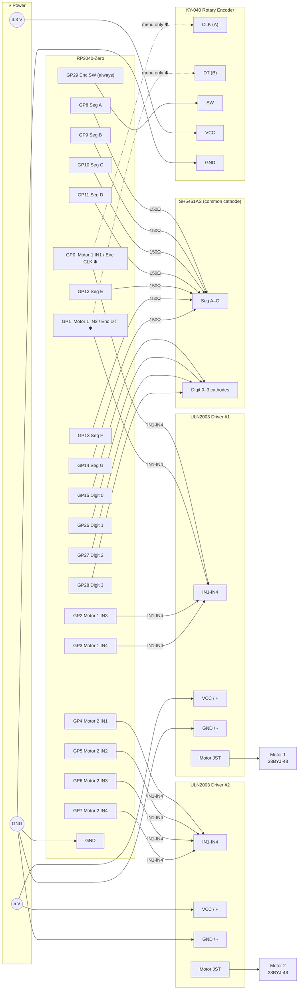

# RP2040-Zero — Dual Stepper + Display + Rotary Encoder

## Components

| Component | Purpose |
|-----------|---------|
| RP2040-Zero | Main controller |
| 2× 28BYJ-48 + ULN2003 driver boards | Stepper motors |
| SH5461AS 4-digit 7-segment display | Status / count display |
| KY-040 rotary encoder | Adjustment knob + push-button |

The RP2040-Zero exposes **20 GPIO via pin headers**: GP0–GP15 and GP26–GP29.
GP16 drives the onboard WS2812B NeoPixel; GP17–GP25 are castellated-edge only.

To fit within 20 pins, GP0 and GP1 serve dual roles:
- **Menu phase** — reconfigured as `INPUT_PULLDOWN` for encoder CLK/DT
- **Winding phase** — reconfigured as `OUTPUT` for Motor 1 IN1/IN2

GP29 (encoder SW / emergency stop) is always `INPUT_PULLUP` regardless of phase.
The decimal-point segment (DP) is omitted; segments A–G are sufficient for all display needs.

---

## Wiring Diagram

---

## RP2040-Zero Pin Reference

> ✱ GP0 and GP1 are shared. The firmware reconfigures them at each phase boundary.

| GPIO | Role | Connected to | Phase |
|------|------|--------------|-------|
| GP0 | Motor 1 IN1 | ULN2003 #1 IN1 | Winding |
| GP0 ✱ | Encoder CLK | KY-040 CLK | Menu |
| GP1 | Motor 1 IN2 | ULN2003 #1 IN2 | Winding |
| GP1 ✱ | Encoder DT | KY-040 DT | Menu |
| GP2 | Motor 1 IN3 | ULN2003 #1 IN3 | Both |
| GP3 | Motor 1 IN4 | ULN2003 #1 IN4 | Both |
| GP4 | Motor 2 IN1 | ULN2003 #2 IN1 | Both |
| GP5 | Motor 2 IN2 | ULN2003 #2 IN2 | Both |
| GP6 | Motor 2 IN3 | ULN2003 #2 IN3 | Both |
| GP7 | Motor 2 IN4 | ULN2003 #2 IN4 | Both |
| GP8 | Segment A | SH5461AS pin A (via 150 Ω) | Both |
| GP9 | Segment B | SH5461AS pin B (via 150 Ω) | Both |
| GP10 | Segment C | SH5461AS pin C (via 150 Ω) | Both |
| GP11 | Segment D | SH5461AS pin D (via 150 Ω) | Both |
| GP12 | Segment E | SH5461AS pin E (via 150 Ω) | Both |
| GP13 | Segment F | SH5461AS pin F (via 150 Ω) | Both |
| GP14 | Segment G | SH5461AS pin G (via 150 Ω) | Both |
| GP15 | Digit 0 cathode | SH5461AS digit 1 common | Both |
| GP26 | Digit 1 cathode | SH5461AS digit 2 common | Both |
| GP27 | Digit 2 cathode | SH5461AS digit 3 common | Both |
| GP28 | Digit 3 cathode | SH5461AS digit 4 common | Both |
| GP29 | Encoder SW | KY-040 SW (emergency stop) | Both |

DP segment is not connected. All 20 header-accessible GPIO are used.

---

## RP2040-Zero → ULN2003 Stepper Detail

The RP2040-Zero's 3.3 V GPIO outputs exceed the ULN2003's ~2.5 V input
threshold — no level shifter required. Motor coil power stays on the 5 V rail
via the ULN2003 boards.

### Motor 1 (GP0–GP3)

| RP2040-Zero | ULN2003 #1 |
|-------------|------------|
| GP0 | IN1 |
| GP1 | IN2 |
| GP2 | IN3 |
| GP3 | IN4 |

### Motor 2 (GP4–GP7)

| RP2040-Zero | ULN2003 #2 |
|-------------|------------|
| GP4 | IN1 |
| GP5 | IN2 |
| GP6 | IN3 |
| GP7 | IN4 |

---

## RP2040-Zero → SH5461AS Display Detail

The SH5461AS is a **common-cathode** display. To light a segment: pull the
digit pin LOW and the segment pin HIGH. Cycle through digits rapidly to
multiplex.

Place a **150 Ω resistor** in series with each segment line (GP8–GP14). At
3.3 V with a ~2 V LED forward voltage and 25% multiplex duty cycle this gives
roughly 8–9 mA per segment — adequate brightness without overloading the GPIO.

| RP2040-Zero | Resistor | SH5461AS |
|-------------|----------|----------|
| GP8 | 150 Ω | Segment A |
| GP9 | 150 Ω | Segment B |
| GP10 | 150 Ω | Segment C |
| GP11 | 150 Ω | Segment D |
| GP12 | 150 Ω | Segment E |
| GP13 | 150 Ω | Segment F |
| GP14 | 150 Ω | Segment G |
| GP15 | — | Digit 1 common cathode |
| GP26 | — | Digit 2 common cathode |
| GP27 | — | Digit 3 common cathode |
| GP28 | — | Digit 4 common cathode |

DP pin on the SH5461AS is left unconnected.

---

## GP0 / GP1 Pin Sharing

GP0 and GP1 connect to **both** ULN2003 #1 (IN1/IN2) and the KY-040 encoder (CLK/DT).
The firmware switches their role at phase boundaries:

| Phase | pinMode | Effect |
|-------|---------|--------|
| Menu | `INPUT_PULLDOWN` | KY-040's 10 kΩ pull-ups drive the lines; ULN2003 inputs held LOW (motors off) |
| Winding | `OUTPUT` | Normal motor step outputs; encoder CLK/DT signals are ignored |

`enterMenuMode()` detaches the CLK interrupt, reconfigures to `INPUT_PULLDOWN`, then re-attaches.  
`enterWindingMode()` detaches the interrupt and reconfigures to `OUTPUT LOW`.

GP29 (encoder SW) is wired **only** to the KY-040 SW pin and stays `INPUT_PULLUP` always,
so the emergency-stop button works during both menu navigation and active winding.

---

## Power Summary

| Rail | Feeds |
|------|-------|
| 5 V (USB or external ≥ 1 A) | ULN2003 boards |
| 3.3 V (RP2040-Zero onboard reg) | KY-040, SH5461AS segments |
| GND | Shared — connect all grounds together |

Both motors can draw ~240 mA each under load (480 mA combined). Use a
dedicated external 5 V supply for the ULN2003 boards when both motors run.

---

## Stepper Half-Step Sequence

| Step | IN4 | IN3 | IN2 | IN1 | Nibble |
|------|-----|-----|-----|-----|--------|
| 1 | 0 | 0 | 0 | 1 | 0x1 |
| 2 | 0 | 0 | 1 | 1 | 0x3 |
| 3 | 0 | 0 | 1 | 0 | 0x2 |
| 4 | 0 | 1 | 1 | 0 | 0x6 |
| 5 | 0 | 1 | 0 | 0 | 0x4 |
| 6 | 1 | 1 | 0 | 0 | 0xC |
| 7 | 1 | 0 | 0 | 0 | 0x8 |
| 8 | 1 | 0 | 0 | 1 | 0x9 |

Reverse the table for reverse direction.
**2048 steps = 1 full revolution** (64:1 gearbox × 32 full steps, half-step mode).

---

## Firmware

The full Arduino sketch lives in [`../src/winder.ino`](../src/winder.ino).
Use the **Earle Philhower RP2040 Arduino core** (`arduino-pico`). No extra
libraries needed — all I/O is direct GPIO.
