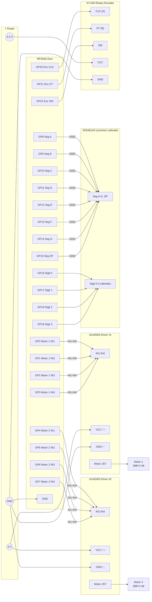

# RP2040-Zero — Dual Stepper + Display + Rotary Encoder

## Components

| Component | Purpose |
|-----------|---------|
| RP2040-Zero | Main controller |
| 2× 28BYJ-48 + ULN2003 driver boards | Stepper motors |
| SH5461AS 4-digit 7-segment display | Status / count display |
| KY-040 rotary encoder | Adjustment knob + push-button |

The RP2040-Zero has 29 usable GPIO — enough to drive both steppers (8 pins),
the SH5461AS directly (12 pins), and the encoder (3 pins) with no expander or
driver ICs needed.

---

## Wiring Diagram



---

## RP2040-Zero Pin Reference

| GPIO | Role | Connected to |
|------|------|--------------|
| GP0 | Motor 1 IN1 | ULN2003 #1 IN1 |
| GP1 | Motor 1 IN2 | ULN2003 #1 IN2 |
| GP2 | Motor 1 IN3 | ULN2003 #1 IN3 |
| GP3 | Motor 1 IN4 | ULN2003 #1 IN4 |
| GP4 | Motor 2 IN1 | ULN2003 #2 IN1 |
| GP5 | Motor 2 IN2 | ULN2003 #2 IN2 |
| GP6 | Motor 2 IN3 | ULN2003 #2 IN3 |
| GP7 | Motor 2 IN4 | ULN2003 #2 IN4 |
| GP8 | Segment A | SH5461AS pin A (via 150 Ω) |
| GP9 | Segment B | SH5461AS pin B (via 150 Ω) |
| GP10 | Segment C | SH5461AS pin C (via 150 Ω) |
| GP11 | Segment D | SH5461AS pin D (via 150 Ω) |
| GP12 | Segment E | SH5461AS pin E (via 150 Ω) |
| GP13 | Segment F | SH5461AS pin F (via 150 Ω) |
| GP14 | Segment G | SH5461AS pin G (via 150 Ω) |
| GP15 | Segment DP | SH5461AS pin DP (via 150 Ω) |
| GP16 | Digit 0 cathode | SH5461AS digit 1 common |
| GP17 | Digit 1 cathode | SH5461AS digit 2 common |
| GP18 | Digit 2 cathode | SH5461AS digit 3 common |
| GP19 | Digit 3 cathode | SH5461AS digit 4 common |
| GP20 | Encoder CLK | KY-040 CLK |
| GP21 | Encoder DT | KY-040 DT |
| GP22 | Encoder SW | KY-040 SW |

GP23–GP28 are available for future use.

---

## RP2040-Zero → ULN2003 Stepper Detail

The RP2040-Zero's 3.3 V GPIO outputs exceed the ULN2003's ~2.5 V input
threshold — no level shifter required. Motor coil power stays on the 5 V rail
via the ULN2003 boards.

### Motor 1 (GP0–GP3)

| RP2040-Zero | ULN2003 #1 |
|-------------|------------|
| GP0 | IN1 |
| GP1 | IN2 |
| GP2 | IN3 |
| GP3 | IN4 |

### Motor 2 (GP4–GP7)

| RP2040-Zero | ULN2003 #2 |
|-------------|------------|
| GP4 | IN1 |
| GP5 | IN2 |
| GP6 | IN3 |
| GP7 | IN4 |

---

## RP2040-Zero → SH5461AS Display Detail

The SH5461AS is a **common-cathode** display. To light a segment: pull the
digit pin LOW and the segment pin HIGH. Cycle through digits rapidly to
multiplex.

Place a **150 Ω resistor** in series with each segment line (GP8–GP15). At
3.3 V with a ~2 V LED forward voltage and 25% multiplex duty cycle this gives
roughly 8–9 mA per segment — adequate brightness without overloading the GPIO.

| RP2040-Zero | Resistor | SH5461AS |
|-------------|----------|----------|
| GP8 | 150 Ω | Segment A |
| GP9 | 150 Ω | Segment B |
| GP10 | 150 Ω | Segment C |
| GP11 | 150 Ω | Segment D |
| GP12 | 150 Ω | Segment E |
| GP13 | 150 Ω | Segment F |
| GP14 | 150 Ω | Segment G |
| GP15 | 150 Ω | Segment DP |
| GP16 | — | Digit 1 common cathode |
| GP17 | — | Digit 2 common cathode |
| GP18 | — | Digit 3 common cathode |
| GP19 | — | Digit 4 common cathode |

---

## Power Summary

| Rail | Feeds |
|------|-------|
| 5 V (USB or external ≥ 1 A) | ULN2003 boards |
| 3.3 V (RP2040-Zero onboard reg) | KY-040, SH5461AS segments |
| GND | Shared — connect all grounds together |

Both motors can draw ~240 mA each under load (480 mA combined). Use a
dedicated external 5 V supply for the ULN2003 boards when both motors run.

---

## Stepper Half-Step Sequence

| Step | IN4 | IN3 | IN2 | IN1 | Nibble |
|------|-----|-----|-----|-----|--------|
| 1 | 0 | 0 | 0 | 1 | 0x1 |
| 2 | 0 | 0 | 1 | 1 | 0x3 |
| 3 | 0 | 0 | 1 | 0 | 0x2 |
| 4 | 0 | 1 | 1 | 0 | 0x6 |
| 5 | 0 | 1 | 0 | 0 | 0x4 |
| 6 | 1 | 1 | 0 | 0 | 0xC |
| 7 | 1 | 0 | 0 | 0 | 0x8 |
| 8 | 1 | 0 | 0 | 1 | 0x9 |

Reverse the table for reverse direction.
**2048 steps = 1 full revolution** (64:1 gearbox × 32 full steps, half-step mode).

---

## Arduino Sketch (RP2040 / Arduino IDE)

Use the **Earle Philhower RP2040 Arduino core** (`arduino-pico`). No extra
libraries needed — all I/O is direct GPIO.

```cpp
// Motor pins
const int M1[4] = {0, 1, 2, 3};
const int M2[4] = {4, 5, 6, 7};

// Display segment pins (A, B, C, D, E, F, G, DP)
const int SEG[8] = {8, 9, 10, 11, 12, 13, 14, 15};
// Display digit cathode pins (digit 0 = leftmost)
const int DIG[4] = {16, 17, 18, 19};

// KY-040 rotary encoder
#define ENC_CLK 20
#define ENC_DT  21
#define ENC_SW  22

// Half-step sequence (IN1 = LSB)
const uint8_t HALF_STEP[8] = {0x1, 0x3, 0x2, 0x6, 0x4, 0xC, 0x8, 0x9};

// 7-segment digit patterns (common cathode, segments A-G)
// Bit 0 = A, bit 1 = B, ... bit 6 = G
const uint8_t DIGIT_PAT[10] = {
  0b0111111, // 0
  0b0000110, // 1
  0b1011011, // 2
  0b1001111, // 3
  0b1100110, // 4
  0b1101101, // 5
  0b1111101, // 6
  0b0000111, // 7
  0b1111111, // 8
  0b1101111, // 9
};

int stepIdx1 = 0;
int stepIdx2 = 0;

void writeMotor(const int pins[4], uint8_t nibble) {
  for (int i = 0; i < 4; i++)
    digitalWrite(pins[i], (nibble >> i) & 1);
}

void stepMotor1(int dir) {
  stepIdx1 = (stepIdx1 + dir + 8) % 8;
  writeMotor(M1, HALF_STEP[stepIdx1]);
}

void stepMotor2(int dir) {
  stepIdx2 = (stepIdx2 + dir + 8) % 8;
  writeMotor(M2, HALF_STEP[stepIdx2]);
}

void releaseMotors() {
  writeMotor(M1, 0);
  writeMotor(M2, 0);
}

// Call frequently from loop() — shows one digit per call, cycling all four
void refreshDisplay(int n) {
  static uint8_t currentDigit = 0;
  n = constrain(n, 0, 9999);

  int digits[4] = {
    n / 1000,
    (n / 100) % 10,
    (n / 10)  % 10,
    n         % 10,
  };

  // Blank all digit cathodes (HIGH = off for common cathode)
  for (int i = 0; i < 4; i++) digitalWrite(DIG[i], HIGH);

  // Set segment pins for this digit
  uint8_t pat = DIGIT_PAT[digits[currentDigit]];
  for (int i = 0; i < 8; i++)
    digitalWrite(SEG[i], (pat >> i) & 1);

  // Enable this digit's cathode
  digitalWrite(DIG[currentDigit], LOW);

  currentDigit = (currentDigit + 1) % 4;
}

volatile int encoderPos = 0;

void onEncoderCLK() {
  encoderPos += (digitalRead(ENC_DT) != digitalRead(ENC_CLK)) ? 1 : -1;
}

void setup() {
  for (int i = 0; i < 4; i++) { pinMode(M1[i], OUTPUT); digitalWrite(M1[i], LOW); }
  for (int i = 0; i < 4; i++) { pinMode(M2[i], OUTPUT); digitalWrite(M2[i], LOW); }
  for (int i = 0; i < 8; i++) { pinMode(SEG[i], OUTPUT); digitalWrite(SEG[i], LOW); }
  for (int i = 0; i < 4; i++) { pinMode(DIG[i], OUTPUT); digitalWrite(DIG[i], HIGH); }

  pinMode(ENC_CLK, INPUT);
  pinMode(ENC_DT,  INPUT);
  pinMode(ENC_SW,  INPUT);  // KY-040 module supplies its own pull-up
  attachInterrupt(digitalPinToInterrupt(ENC_CLK), onEncoderCLK, CHANGE);
}

void loop() {
  refreshDisplay(abs(encoderPos));

  static int lastPos = 0;
  if (encoderPos != lastPos) {
    stepMotor1(encoderPos > lastPos ? 1 : -1);
    lastPos = encoderPos;
    delay(2);  // inter-step delay — lower = faster
  }

  // Button: active LOW
  if (digitalRead(ENC_SW) == LOW) {
    releaseMotors();
    delay(200);  // debounce
  }
}
```

> **Display refresh rate:** `refreshDisplay()` advances one digit per call.
> With a ~2 ms stepper delay the full 4-digit cycle completes in ~8 ms (~125 Hz),
> which is flicker-free. If stepper delays increase, call `refreshDisplay()`
> more frequently or move it to a repeating timer interrupt.
